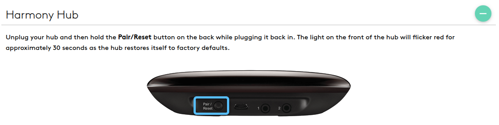
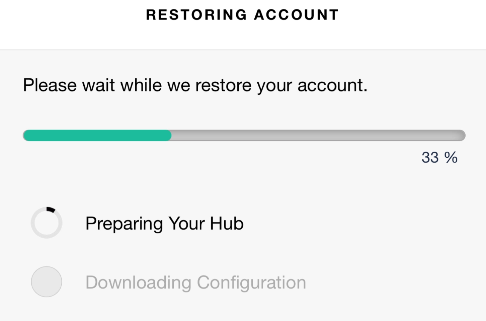

# Harmony Hub Setup

Configure a factory-reset Logitech Harmony Hub far enough for the official
Harmony mobile app to finish account/profile restore.

This tool performs **Phase 1** only:

1. Connects to the hub over Bluetooth.
2. Finds the target Wi-Fi network.
3. Connects the hub to Wi-Fi.
4. Sends the dummy discovery provisioning command (`mode=2`).
5. Verifies the hub is still pre-account and reachable on the local network.

The official Harmony iPhone or Android app performs **Phase 2**:

1. Finds the hub on the network.
2. Logs in to the Logitech account.
3. Restores the hub's devices, activities, and account profile.

## Why this exists

Since early 2025, connecting to my Logitech Harmony Hub from the iPhone app
has become increasingly difficult and buggy. The usual recovery path --
factory reset the hub and let the iPhone app re-provision it from my Logitech
account -- has itself become fraught and unreliable on the iPhone in that
same window. The hub frequently fails to join Wi-Fi during the app's setup
flow even when the network is healthy and well in range, leaving the hub
unreachable.

This tool exists to take that fragile Wi-Fi join out of the iPhone app's
hands. It does the Bluetooth handshake, Wi-Fi join, and dummy discovery
provisioning over RFCOMM from a Linux computer, then verifies the hub is
sitting on the network in the pre-account state the app expects. From that
point the iPhone app only has to do its Phase 2 work (find the hub on the
network, sign in, restore the profile), which in my experience has been
the more reliable half of the flow.

## Requirements

- Linux with Bluetooth support.
- `bluetoothctl` from BlueZ available on `PATH`.
- `uv` for running the project from source.
- A Harmony Hub that has been factory reset.
- The Wi-Fi network name and password for the network the hub should join.

## Factory Reset the Hub

Phase 1 setup assumes the hub starts from a clean factory-reset state.

Unplug your hub and then hold the **Pair/Reset** button on the back while
plugging it back in. The light on the front of the hub will flicker red for
approximately 30 seconds as the hub restores itself to factory defaults.



Once the flickering stops and the hub re-enters Bluetooth setup mode, continue
with the next section.

## Discover the Hub

After factory reset, plug in the hub and wait for it to enter Bluetooth setup
mode. Then run:

```bash
uv run harmony-hub-setup discover
```

The command scans with `bluetoothctl` and prints nearby devices. A typical
result looks like:

```text
Bluetooth devices:
  AA:BB:CC:DD:EE:FF  Harmony Hub  [Harmony candidate]
```

If a Harmony candidate is listed, use that address with `--address`. If setup is
run without `--address`, it will auto-discover and use the address only when
exactly one Harmony-looking device is found.

## Phase 1 Setup

Run:

```bash
uv run harmony-hub-setup setup \
  --ssid "Your Wi-Fi Name" \
  --password "Your Wi-Fi Password" \
  --encryption WPA2-PSK
```

Or pass the Bluetooth address explicitly:

```bash
uv run harmony-hub-setup \
  --address AA:BB:CC:DD:EE:FF \
  setup \
  --ssid "Your Wi-Fi Name" \
  --password "Your Wi-Fi Password" \
  --encryption WPA2-PSK
```

The setup command prints numbered progress steps. Phase 1 is complete when it
prints:

```text
PHASE 1 COMPLETE
The hub is on Wi-Fi, in mode=2, and reachable through the local setup endpoint.
Open the Harmony mobile app and continue account/profile restore from there.
```

At that point, open the Harmony mobile app, select the hub found on the network,
log in to the Logitech account, and let the app restore the profile.

## Example Output

A successful run looks like this (placeholders shown for the Bluetooth address,
SSID, and IP):

```text
No Bluetooth address provided; scanning for Harmony Hub candidates...
Bluetooth devices:
  AA:BB:CC:DD:EE:FF  Harmony Hub  [Harmony candidate]

Using discovered Harmony Hub: AA:BB:CC:DD:EE:FF Harmony Hub

Waiting for Harmony Hub Bluetooth...
(Factory reset the hub if you haven't already)

Connected on attempt 1!

[1/8] Verify Bluetooth command channel
  Hub alive (uuid=...)

[2/8] Scan for target Wi-Fi network
  Found target SSID (signal=212, security=WPA2-PSK, channel=2422)

[3/8] Get Bluetooth nonce
  Nonce received (32 chars).

[4/8] Connect hub to Wi-Fi (Your Wi-Fi Name)
  Wi-Fi command attempt 1 returned code=500; retrying.
  Wi-Fi command accepted on attempt 2.
  Connected! IP: 192.0.2.200

[5/8] Set discovery provisioning over Bluetooth
  Provision command accepted.

[6/8] Confirm pre-account Phase 1 handoff state over Bluetooth
  Bluetooth provision-info: mode=2, account=not set, secure=True

[7/8] Read Bluetooth setup gates
  RF info response: code=200
  Firmware: 4.15.600
  Wi-Fi: connected
  SSID: Your Wi-Fi Name
  IP: 192.0.2.200

[8/8] Verify local hub setup endpoint
  LAN ping OK: http://192.0.2.200:8088
  LAN system-info OK.
  Hub firmware: 4.15.600
  LAN provision-info OK.
  Provision mode: 2
  Account ID:      not set
  Auth token:      not set
  LAN Phase 1 handoff: mode=2, account=not set, secure=True
  LAN discovery-info OK.
  LAN paired-device info OK.
  LAN firmware check OK.

Final state
  Discovery server: https://svcs.myharmony.com/Discovery/Discovery.svc
  SUS channel:      Production
  Mode:             2

PHASE 1 COMPLETE
The hub is on Wi-Fi, in mode=2, and reachable through the local setup endpoint.
Open the Harmony mobile app and continue account/profile restore from there.
```

The `PHASE 1 COMPLETE` block at the end is the cue to switch to the Harmony
mobile app for Phase 2.

## Phase 2: Restore Your Account in the App

Open the Harmony mobile app, select your hub from the list, and sign in to
your Logitech account. The app will start restoring your hub's profile.

### Press the Pair/Reset button when the app asks

Roughly a third of the way through the restore (around the **Preparing Your
Hub** step), the app will pause and ask you to press the **Pair/Reset**
button on the back of the hub again. This is expected every time -- it is
not a sign that anything has gone wrong.



Press the button once, then let the app continue. The remainder of the
restore should complete without further prompts.

### Wait before unplugging

After the app reports restore is complete, **leave the hub powered for at
least two minutes** before you unplug it to move it. This gives the hub
time to fully persist the new configuration to flash. Unplugging too soon
has been observed to roll the hub back to an unprovisioned state, forcing
a fresh factory reset.

## What Success Means

Successful Phase 1 means:

- Bluetooth setup commands worked.
- The hub joined Wi-Fi and has a local IP address.
- Local setup probes work over `http://<hub-ip>:8088`.
- Provision info reports `mode=2`.
- Account ID, auth token, email, username, and active remote ID are not set.

It does **not** mean the hub has been fully account-provisioned. Full restore is
complete only after the Harmony mobile app finishes Phase 2.

## Troubleshooting

If discovery finds no Harmony candidate:

- Confirm the hub was factory reset.
- Keep the hub powered on and near the computer.
- Run `bluetoothctl scan on` manually to confirm Linux can see Bluetooth
  devices.
- Re-run setup with `--address` if you know the hub's Bluetooth address.

If setup fails during Wi-Fi connection:

- Confirm the SSID and password.
- Confirm the hub is close enough to the Wi-Fi access point.
- Re-run setup after another factory reset if the hub is in an unknown state.

If the mobile app cannot find the hub after Phase 1 completes:

- Confirm the phone is on the same network as the hub.
- Wait briefly for the hub to appear in the app.
- Run `harmony-hub-setup --address <address> status` while Bluetooth is still
  available to inspect the hub state.
